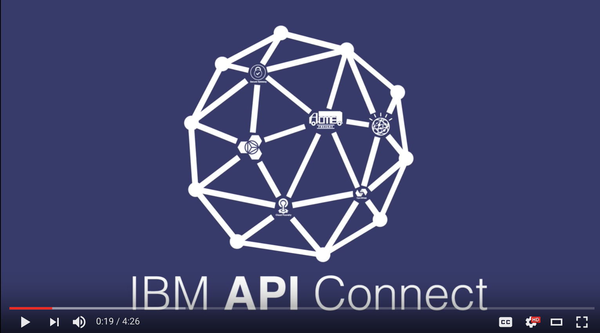

# A Jornada da Acme Freight *Ler em outros idiomas: [한국어](README-ko.md).* A Acme Freight Shipping é uma empresa de remessa e logística fictícia que usa a estrutura do aplicativo [Logistics Wizard](https://github.com/ibm-bluemix/logistics-wizard) para reimaginar sistemas de otimização da cadeia de suprimento para o século XXI. A Acme Freight utiliza um aplicativo, chamado [Logistic Wizard](https://github.com/ibm-bluemix/logistics-wizard), para gerenciar alguns dos seus ativos. O aplicativo é composto por diversos microsserviços, incluindo três aplicativos do Cloud Foundry e várias ações do OpenWhisk. A Acme Freight usa o LoopBack, uma estrutura Node.js de software livre desenvolvida para criar e expor rapidamente APIs para aplicativos e dados novos e existentes. Com o LoopBack, a Acme Freight pode criar um aplicativo que se integre ao sistema existente de ERP, enquanto o API Connect permite a exposição de dados por uma API gerenciada. *Para saber mais sobre a jornada da Acme Freight e as tecnologias por trás dela, [acesse o website da jornada da Acme Freight](http://developer.ibm.com/code/journey/unlock-enterprise-data-using-apis?cm_mmc=github-code-_-native-_-acme-_-journey&amp;cm_mmca1=000019RT&amp;cm_mmca2=10004796).* ## Tutoriais da Acme Freight Para começar a saber mais sobre a Acme Freight e a tecnologia por trás dela, escolha um dos tutoriais abaixo. ### Implementar a Acme Freight * [Implemente sua própria Acme Freight com a cadeia de ferramentas do IBM DevOps](TOOLCHAIN-README.md) &gt;  ### Crie APIs rapidamente com a estrutura de API do nó, LoopBack * [Use LoopBack e API Connect para expor dados de ERP rapidamente com APIs](APIC-ERP-README.md) ### Crie APIs protegidas para ações do OpenWhisk em poucos cliques * [Crie APIs protegidas para ações do OpenWhisk no Bluemix](OW-NAPI-README.md) ## Visão geral da Acme Freight O vídeo abaixo demonstra como a Acme Freight Shipping usou a estrutura do Logistics Wizard, junto com o IBM API Connect, para oferecer um aplicativo que permitisse revolucionar a agilidade da cadeia de suprimento.  ## Arquitetura da Acme Freight  Os projetos a seguir são aproveitados na solução geral da Acme Freight: * [acme-freight-erp](https://github.com/ibm/acme-freight-erp) - define a API usada pela Acme Freight para acessar dados de um sistema de ERP. Também oferece uma implementação padrão para usar como simulador. O simulador é um aplicativo Node.js conectado a um banco de dados PostgreSQL. Por meio da sua API, gerencia usuários (gerentes de cadeia de suprimento e gerentes de lojas de varejo), centros de distribuição, lojas de varejo e remessas. * [acme-freight-webui](https://github.com/ibm/acme-freight-webui) - oferece um painel para visualizar remessas e alertas em andamento. Não existem credenciais de login ou do usuário propriamente ditas para utilizar os aplicativos implementados. Em vez disso, um ID de demonstração exclusivo é atribuído a qualquer usuário novo que esteja experimentando o aplicativo. Atrás de cada ID de demonstração, a Acme Freight cria um ambiente isolado com um conjunto padrão de usuários corporativos, centros de distribuição, lojas de varejo e remessas. Consulte o [passo a passo](WALKTHROUGH.md) para fazer um tour pelos recursos. * [acme-freight-recommendation](https://github.com/ibm/acme-freight-recommendation) - faz recomendações sobre as remessas com base nas condições meteorológicas. Trata-se de uma configuração do Bluemix OpenWhisk para recuperar as condições meteorológicas atuais e, considerando um evento climático, gerar novas recomendações sobre as remessas. Em seguida, essas recomendações podem ser transformadas em pedidos reais. * [acme-freight-controller](https://github.com/ibm/acme-freight-controller) - funciona como o principal controlador para a interação entre os serviços. Recebe solicitações da interface com o usuário e as encaminha para o ERP ou para o módulo de recomendações meteorológicas. *A Acme Freight é bifurcada e estendida a partir do projeto IBM Bluemix, chamado de Logistics Wizard. Visite a [wiki](https://github.com/IBM-Bluemix/logistics-wizard/wiki) do projeto Logistics Wizard para encontrar uma análise detalhada da arquitetura e da estratégia de implementação originais do Logicistics Wizard.* ## Recursos - [A Jornada da Acme Freight](http://developer.ibm.com/code/journey/unlock-enterprise-data-using-apis?cm_mmc=github-code-_-native-_-acme-_-journey&amp;cm_mmca1=000019RT&amp;cm_mmca2=10004796) - [Liberte dados corporativos com o LoopBack](https://developer.ibm.com/code/2017/05/04/unlock-enterprise-data-with-loopback?cm_mmc=github-code-_-native-_-acme-_-related-content&amp;cm_mmca1=000019RT&amp;cm_mmca2=10004796) ## Licença Consulte [LICENÇA](LICENÇA) para obter informações sobre a licença. 